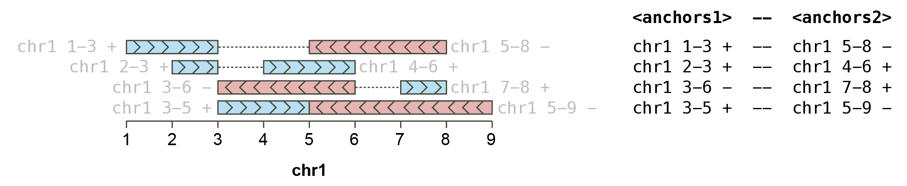
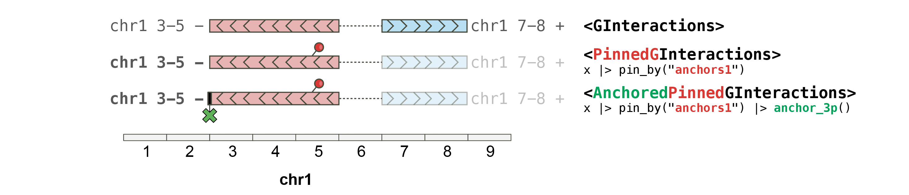

```{r setup, include = FALSE}
knitr::opts_chunk$set(
    collapse = TRUE,
    comment = "#>",
    crop = NULL ## Related to https://stat.ethz.ch/pipermail/bioc-devel/2020-April/016656.html
)
options(width = 9999)
```

```{r vignetteSetup, echo=FALSE, message=FALSE, warning = FALSE}
## Bib setup
library("RefManageR")
bib <- c(
    R = citation(),
    InteractionSet = citation("InteractionSet")[1],
    BiocStyle = citation("BiocStyle")[1],
    knitr = citation("knitr")[1],
    RefManageR = citation("RefManageR")[1],
    rmarkdown = citation("rmarkdown")[1],
    sessioninfo = citation("sessioninfo")[1],
    testthat = citation("testthat")[1],
    dplyr = citation("dplyr")[1],
    rlang = citation("rlang")[1],
    plyranges = citation("plyranges")[1],
    plyinteractions = citation("plyinteractions")[1]
)
```

# Introduction

The `r Biocpkg("plyinteractions")` package
introduces tidy methods for the `GInteractions` class defined in the 
`r Biocpkg("InteractionSet")` package `r Citep(bib[["InteractionSet"]])`. 

## `GInteractions` objects

`GInteractions` are objects describing interactions between two parallel 
sets of genomic ranges. 

```{r}
library(GenomicRanges)
library(InteractionSet)
anchor1 <- GRanges("chr1:10-20:+")
anchor2 <- GRanges("chr1:50-60:-")
gi <- GInteractions(anchor1, anchor2)

gi
```

The `r Biocpkg("InteractionSet")` package provides basic methods to interact
with this class, but does not support tidy grammar principles. 

## Tidy grammar principles

The grammar of tidy genomic data transformation defined in 
`r Biocpkg("plyranges")` 
and available for `GInteractions` currently supports: 

- `r CRANpkg("dplyr")` verbs (for `GInteractions` and `GroupedGInteractions`): 

  - Group genomic interactions with `group_by`; 
  - Summarize grouped genomic interactions with `summarize`; 
  - Tally/count grouped genomic interactions with `tally` and `count`; 
  - Modify genomic interactions with `mutate`; 
  - Subset genomic interactions with `filter` using
  [`<data-masking>`](https://rlang.r-lib.org/reference/args_data_masking.html) 
  and logical expressions; 
  - Pick out any columns from the associated metadata with `select` 
  using [`<tidy-select>` arguments](https://dplyr.tidyverse.org/reference/dplyr_tidy_select.html); 
  - Subset using indices with `slice`;
  - Order genomic interactions with `arrange` using categorical/numerical 
  variables. 


- `r Biocpkg("plyranges")` verbs (for `PinnedGInteractions` and `AnchoredPinnedGInteractions`): 

  - Stretch specific anchors of genomic interactions to a given width with `stretch`;
  - `anchor_*` functions to control how stretching is performed; 
  - Shift specific anchors of genomic interactions with `shift`;
  - Obtain flanking `GRanges` from specific anchors of genomic interactions with `flank`.

# Importing genomic interactions in R

`r Biocpkg("plyinteractions")` provides a consistent interface for importing 
genomic interactions from `pairs` and `bedpe` files into GInteractions in R, 
following grammar of tidy data manipulation defined in the 
`r CRANpkg("tidyverse")` ecosystem. 

## From bed-like text files

Tidy genomic data maniuplation implies that we first parse genomic 
files stored on disk as tabular data frames. 

```{r "start", message=FALSE}
## This uses an example `bedpe` file provided in the `rtracklayer` package
bedpe_file <- system.file("tests", "test.bedpe", package = "rtracklayer")
bedpe_df <- read.delim(bedpe_file, header = FALSE, sep = '\t')

bedpe_df
```

Genomic interactions in tabular format are not easy to manipulate.
We can easily parse a `data.frame` into a `GInteractions` object using 
the `as_ginteractions` function. 

```{r}
library(plyinteractions)
gi <- bedpe_df |> 
    as_ginteractions(
        seqnames1 = V1, start1 = V2, end1 = V3, strand1 = V9, 
        seqnames2 = V4, start2 = V5, end2 = V6, strand2 = V10, 
        starts.in.df.are.0based = TRUE
    )

gi
```

The columns containing information for core fields of the future `GInteractions` 
object (e.g. `seqnames1`, `strand2`, ...) can be specified using the 
`key = value` (supported by quasiquotation). 

## From `pairs` files 

The `pairs` file format has been formally defined by the **4DN consortium**. 
Its specifications are available [here](https://github.com/4dn-dcic/pairix/blob/master/pairs_format_specification.md).  

It can be imported in R as a `data.frame` using `read.delim` or any other 
tabular data import functions (including `fread` or `vroom` for larger files), 
and readily coerced into `GInteractions` with `as_ginteractions`. 

```{r}
## This uses an example `pairs` file provided in this package
pairs_file <- system.file('extdata', 'pairs.gz', package = 'plyinteractions') 
pairs_df <- read.delim(pairs_file, sep = "\t", header = FALSE, comment.char = "#")
head(pairs_df)
pairs <- as_ginteractions(pairs_df, 
    seqnames1 = V2, start1 = V3, strand1 = V6, 
    seqnames2 = V4, start2 = V5, strand2 = V7, 
    width1 = 1, width2 = 1, 
    keep.extra.columns = FALSE
)
pairs
```

## Reverting from `GInteractions` to tabular data frames

The reverse operation to coerce `GInteractions` back to a tabular form is 
also possible using the `as_tibble` function from the `r CRANpkg("tibble")` package: 

```{r}
tibble::as_tibble(gi)
```

# Getter functions

## `anchors{12}`

A `GInteractions` object consists of two sets of **_anchors_**: 
`anchors1` and `anchors2`.



```{r}
gi <- read.table(text = "
chr1 1 10 chr1 1 15 + + cis
chr1 6 15 chr1 1 20 + + cis
chr1 6 20 chr1 6 30 - - cis
chr1 11 30 chr2 11 30 - - trans",
col.names = c(
  "seqnames1", "start1", "end1", 
  "seqnames2", "start2", "end2", "strand1", "strand2", 
  "type")
) |> 
  as_ginteractions()

## `anchors` returns the two sets of anchors (i.e. "left" and "right" 
## loci) for each genomic interaction

anchors(gi)

## `anchors1` and `anchors2` specifically return the "left" OR "right" 
## loci) for each genomic interaction

anchors1(gi)

anchors2(gi)
```

**Important note**: the term **_anchors_**, when used for `GInteractions`, 
refers to the "left-hand" or "right-hand" `GRanges` when looking at genomic 
interactions. This is different from the `anchor` term used in `r Biocpkg("plyranges")`. 
This is due to the fact that *"anchor"* is used in the chromatin interaction 
field to refer to the ends of a potential chromatin loop.

## Core `GInteractions` fields

`seqnames`, `start`/`end`, `width` and `strand` return informative core fields 
of a `GRanges` object. Appending `1` or `2` to these functions allow 
the end-user to fetch the corresponding fields from `GInteractions` objects. 

```{r}
## Similarly to `GRanges` accessors, `seqnames`, `start`, `end`, `strand` and 
## `width` are all available for each set of `anchors` of a `GInteractions`. 

seqnames1(gi)

start1(gi)

end2(gi)

strand2(gi)

width2(gi)
```

## Metadata columns

`GInteractions` contain associated metadata stored as a `DataFrame` which 
can be recovered using the standard `mcols` function: 

```{r}
mcols(gi)
```

Individual metadata columns can also be accessed using the `$` notation. 
Auto-completion is enabled for this method. 

```{r}
gi$type
```

## Extra genomic-related informations 

Accessor functions provided in the `r Biocpkg("InteractionSet")` 
package (which defines the `GInteractions` class) are also available. 

```{r}
regions(gi)

seqinfo(gi)
```

# Pinned (and anchored) `GInteractions`

The anchoring approach developed in the `r Biocpkg("plyranges")` package allows handy control 
over the way a `GRanges` object is extended when using the `stretch` 
function. To enable such workflow for `GInteractions`, two classes were defined: 
`PinnedGInteractions` and `AnchoredPinnedGInteractions`. 



## `PinnedGInteractions`

Pinning a `GInteractions` object is used to specify which set of anchors
(i.e. `anchors1` or `anchors2`) should be affected by `r Biocpkg("plyranges")` functions. 

```{r}
## `pin_by` is used to pin a `GInteractions` on "first" (i.e. "left") or 
## "second" (i.e. "right") anchors. 

gi |> pin_by("first")

pgi <- gi |> pin_by("second")
pin(pgi)

pinned_anchors(pgi)
```

A pinned `GInteractions` object can be reverted back to a unpinned 
`GInteractions` object. 

```{r}
unpin(pgi)
```

## `AnchoredPinnedGInteractions`

Some `r Biocpkg("plyranges")` operations can work on "`anchored"` **_`GRanges`_**. To 
enable these operations either on `anchors1` or `anchors2` from 
a **_`GInteractions`_** object, the "pinned"
`anchors{12}` of the `GInteractions` object can be further "anchored". 

```{r pin}
gi |> pin_by("first") |> anchor_5p()
```

# `plyranges` operations on `GInteractions`

`r Biocpkg("plyranges")` arithmetic functions are available for 
`(Anchored)PinnedGInteractions` objects. 

**Important note 1:** `GInteractions` must be pinned to a specific anchor set 
(`anchors1` or `anchors2`) for `r Biocpkg("plyranges")` functions to work. Please use 
`pin_by()` function to pin `GInteractions`. 

**Important note 2:** the `stretch` function will behave on 
`PinnedGInteractions` and `AnchoredPinnedGInteractions` objects similarly 
to `GRanges` or `AnchoredGRanges` objects. 

## On `PinnedGInteractions` objects

`r Biocpkg("plyinteractions")` extends the use of verbs developed in `plyranges`
to manipulate `GRanges` objects, to ensure they work on `GInteractions`. 
The `GInteractions` **must** be "pinned" (using `pin_by()`) in order 
to specify which set of anchors should be affected by `plyranges` functions. 


```{r pin_stretch}
gi

## This pins the "first" (i.e. "left") anchors and strecthes them by 10bp

gi |> pin_by("first") |> stretch(10)

## This pins the "first" (i.e. "left") anchors and shift them 
## by 20bp to the right

gi |> pin_by("first") |> shift_right(20)

## This pins the "first" (i.e. "left") anchors and extracts 20bp 
## flanking these "first" anchors

gi |> pin_by("first") |> flank_right(20)
```

## On `AnchoredPinnedGInteractions` objects

When a pinned `GInteractions` is further anchored, `stretch`ing with `r Biocpkg("plyranges")`
relies on the anchoring:


```{r pin_anchor_stretch}
## This pins the "first" (i.e. "left") anchors and strecthes them by 10bp, 
## with the "first" anchors being anchored at their **start**. 

gi |> pin_by("first") |> anchor_start() |> stretch(10)

## This pins the "first" (i.e. "left") anchors and strecthes them by 10bp, 
## with the "first" anchors being anchored at their **center**. 

gi |> pin_by("first") |> anchor_center() |> stretch(10)
```

# `dplyr` operations on `GInteractions`

`r Biocpkg("plyinteractions")` provides a set of verbs for developing 
analysis pipelines based on `GInteractions` objects that represent genomic 
interactions. The verbs extend `r CRANpkg("dplyr")` functionalities to operate on a 
`GInteractions` object as if it were a tabular data object. 

## Mutating columns 

`mutate` supports accessing other existing columns:

```{r}
## This creates a new metadata column named `cis`

gi |> mutate(cis = seqnames1 == seqnames2)

## This creates a new metadata column named `both_chr`

gi |> mutate(both_chr = paste(seqnames1, seqnames2, sep = "_"))

## This modifies `start1`, i.e. the `start` coordinates of the "first"
## (i.e. "left") anchors of the `GInteractions` object. 

gi |> mutate(start1 = 1)
```

## Grouping columns 

`group_by` supports accessing both core and metadata columns:

```{r}
## This groups the `GInteractions` object using the `seqnames2` variable
## (i.e. the `seqnames` of the "second" anchors of the `GInteractions`). 

gi |> group_by(seqnames2)

## This groups the `GInteractions` object by a new variable named `cis`

gi |> group_by(cis = seqnames1 == seqnames2)

## This groups the `GInteractions` object by two variables, `seqnames2` 
## and the new variable `cis`

gi |> group_by(seqnames2, cis = seqnames1 == seqnames2)
```

## Summarizing columns 

Summarizing grouped `GInteractions` can be extremely powerful. 

```{r}
## This counts the number of occurences of each combination of the variables
## `strand1` and `strand2`

pairs |> count(strand1, strand2)

## This counts the number of pairs located on the same strand 
## or different strands

gi |> group_by(same_strand = strand1 == strand2) |> tally()

## This counts the number of pairs located on the same strand 
## or different strands

pairs |> group_by(same_strand = strand1 == strand2) |> 
    summarize(
        neg_strand = sum(strand1 == "-"), 
        pos_strand = sum(strand1 == "+")
    )
```

## Filtering columns 

`filter` supports logical expressions:

```{r}
gi |> filter(seqnames1 == 'chr11')

gi |> filter(start1 >= 1e8)

gi |> filter(seqnames1 == seqnames2)
```

## Selecting columns 

`select` supports [`<tidy-select>` arguments](https://dplyr.tidyverse.org/reference/dplyr_tidy_select.html):

```{r}
## This only keeps the "type" column from the metadata columns, 
## using <tidy-select> methodology

gi |> select(type)

gi |> select(contains("typ"))

gi |> select(starts_with("ty"))
```

Note that core fields (e.g. `seqnames1`, `strand2`, ...) cannot be retrieved 
using this approach, only metadata columns are parsed. 
Selecting a subset of core fields from a `GInteractions` would lead to 
loss of required information (the other non-selected core fields). 

```{r}
## This does not restrict to `seqnames1` and `seqnames2` columns. 

gi |> select(starts_with('seq')) 
```

Forcing selection of core fields is still possible when using the `.drop_ranges`
argument of `select()`. This results in the coercion of the selected columns 
into a `DataFrame`. 

```{r}
## This selects `seqnames1` and `seqnames2` columns but converts the output
## into a `DataFrame`.

gi |> select(starts_with('seq'), .drop_ranges = TRUE) 
```

## Slicing rows 

```{r}
## This only retains specific pair indices

gi |> slice(1, 2)

gi |> slice(-3)
```

# Overlapping operations on `GInteractions`

Several operlapping functions defined in `r Biocpkg("plyranges")` are available for 
`GInteractions`: 

- `find_overlaps`;
- `count_overlaps`;
- `filter_by_overlaps` and `filter_by_non_overlaps`;
- `join_overlap_left`.

All these functions can take a `GInteractions` query and a `GRanges` subject
to perform overlapping operations, and `maxgap` and `minoverlap` arguments 
are available to refine the query. 

These functions are **unstranded** by default. `find_overlaps`, 
`count_overlaps` and `join_overlap_left` functions have `*_directed` 
counterparts for when strandness is required. 

## Overlapping `GInteractions`

`overlap`ping methods defined for `GInteractions` have also been adapted to 
work in a "tidy" manner. 

```{r}
gr <- GRanges(c("chr1:25-30:-", "chr2:16-20:+"))
gi$id <- seq_len(length(gi))
gr$id <- seq_len(length(gr))

## This returns the `GInteractions` entries overlapping with a `GRanges`
## (with either of both anchors)

find_overlaps(gi, gr)

## This overlap requires the same strandness between 
## the `GInteractions` anchors and the `GRanges` object

find_overlaps_directed(gi, gr)

## This counts how many times each entry in a `GInteractions` object 
## overlaps with a `GRanges` object (with either of both anchors)

count_overlaps(gi, gr)

count_overlaps_directed(gi, gr)

## This filters a `GInteractions` object to only retain the entries 
## overlapping (or not) with a `GRanges` (with either of both anchors)

filter_by_overlaps(gi, gr)

filter_by_non_overlaps(gi, gr)

## This performs a left join between `GInteractions` entries and
## a `GRanges` of interest (with/without considering strandness)

join_overlap_left(gi, gr)

join_overlap_left_directed(gi, gr)
```

## Overlapping pinned `GInteractions`

`PinnedGInteractions` can also be used in overlapping functions. In this case, 
only the pinned anchors are used when computing overlaps. 

```{r}
## This returns the `GInteractions` entries for which 
## the "first" anchor overlaps with a `GRanges`

gi |> pin_by("first") |> find_overlaps(gr)

## This returns the `GInteractions` entries for which 
## the "second" anchor overlaps with a `GRanges`

gi |> pin_by("second") |> find_overlaps(gr)
```

# Citing `plyinteractions`

We hope that `r Biocpkg("plyinteractions")` will be useful for your research. 
Please use the following information to cite the package and the overall 
approach. Thank you!

```{r "citation"}
## Citation info
citation("plyinteractions")
```

# Acknowledgments

The `r Biocpkg("plyinteractions")` package 
introduces tidy methods for the `GInteractions` class defined in the 
`r Biocpkg("InteractionSet")` package `r Citep(bib[["InteractionSet"]])`. 

The `r Biocpkg("plyinteractions")` package 
follows tidy principles defined for tabular data and genomic ranges:

* `r CRANpkg("dplyr")` `r Citep(bib[["dplyr"]])`
* `r CRANpkg("rlang")` `r Citep(bib[["rlang"]])`
* `r Biocpkg("plyranges")` `r Citep(bib[["plyranges"]])`

The `r Biocpkg("plyinteractions")` package `r Citep(bib[["plyinteractions"]])`
was written using the following resources:

* R `r Citep(bib[["R"]])`
* `r CRANpkg("devtools")`
* `r CRANpkg("usethis")`

Supporting documentation was generated using the following resources: 

* `r Biocpkg("BiocStyle")` `r Citep(bib[["BiocStyle"]])`
* `r CRANpkg("knitr")` `r Citep(bib[["knitr"]])`
* `r CRANpkg("RefManageR")` `r Citep(bib[["RefManageR"]])`
* `r CRANpkg("rmarkdown")` `r Citep(bib[["rmarkdown"]])`

# Reproducibility 

`R` session information:

```{r reproduce3, echo=FALSE}
## Session info
library("sessioninfo")
options(width = 120)
session_info()
```

# Bibliography

```{r vignetteBiblio, results = "asis", echo = FALSE, warning = FALSE, message = FALSE}
## Print bibliography
PrintBibliography(bib, .opts = list(hyperlink = "to.doc", style = "html"))
```
